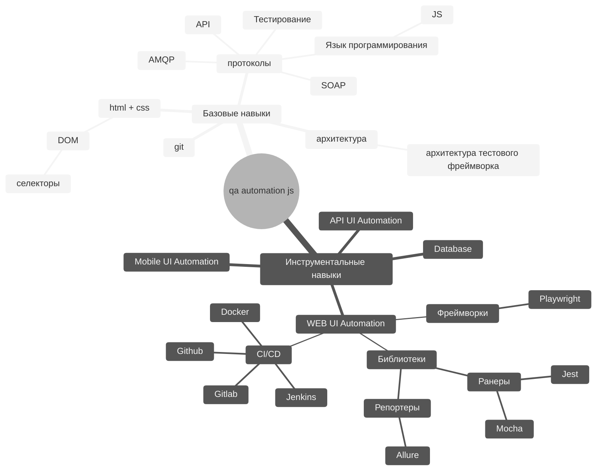

# QA.GURU + Javascript

## Как готовится?
По желанию до начала занятий можно: 

### Программирование
- [codebasic] - Бесплатный курс по Javascript
- [git] - Бесплатный курс по Git

### Чаты и каналы
 - [chat] - Вступите в чат школы qa.guru и задайте любые вопросы по курсу

## Карта развития для JS автоматизатора
JS Automation Roadmap:

[//]: # (These are reference links used in the body of this note and get stripped out when the markdown processor does its job. There is no need to format nicely because it shouldn't be seen. Thanks SO - http://stackoverflow.com/questions/4823468/store-comments-in-markdown-syntax)

[chat]: https://t.me/qa_guru_chat
[codebasic]: <https://code-basics.com/ru/languages/javascript>
[git]:  https://ru.hexlet.io/courses/intro_to_git
