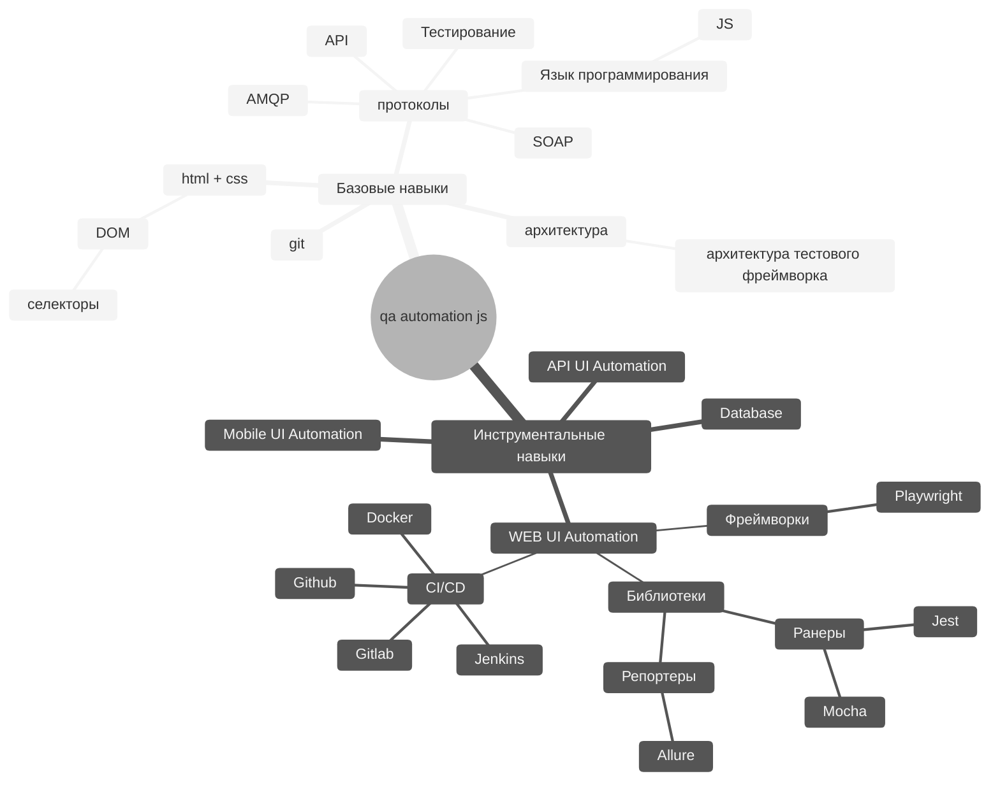

# QA.GURU + Javascript

## Как готовится?
[Программа курса][program]

[Настрой рабочее место][localEnv]
### Программирование
По желанию до начала занятий можно: 
- [codebasic] - Бесплатный курс по Javascript
- [git] - Бесплатный курс по Git

### Чаты и каналы
 - [chat] - Вступите в чат школы qa.guru и задайте любые вопросы по курсу

## Краткая программа курса
### Программирование
- [x] Разберемся с основами Javascript
- [x] Разберемся с GIT
---
### WEB-автоматизация
- [x] Покроем автотестами интернет-магазин
- [x] Покроем автотестами блог-платформу
- [x] Научимся генерировать тестовые данные
- [x] Подключим отчет Allure Reports
---
### API-автоматизация
- [x] Попробуем самые популярные библиотеки для работы с API
- [x] Научимся генерировать тестовые данные через API и базу данных
- [x] Научимся подготавливать тестовые данные через API и базу данных
- [x] Разберемся как делать заглушки для API (моковые данные)
- [x] Посмотрим как можно визуализировать API coverage
---
### Mobile-автоматизация
- [x] Покроем автотестами мобильное приложение используя appium
---
### Инфраструктура
- [x] Рассмотрим разные способы встраивания автотестов в процесс разработки
- [x] Развернем собственный стенд для запуска автотестов локально и в Docker;
- [x] Разберем как интегрировать автотесты в процесс CI/CD на примере github/gitlab/jenkins
- [x] Научимся отправлять уведомления о статусе тестов в мессенджеры (Telegram, etc)
- [x] Объединим ручные тесты и авто-тесты в единый тест-план в Allure TestOps;

## Карта развития для JS автоматизатора
JS Automation Roadmap:

[//]: # (These are reference links used in the body of this note and get stripped out when the markdown processor does its job. There is no need to format nicely because it shouldn't be seen. Thanks SO - http://stackoverflow.com/questions/4823468/store-comments-in-markdown-syntax)

[chat]: https://t.me/qa_guru_chat
[codebasic]: <https://code-basics.com/ru/languages/javascript>
[git]:  https://ru.hexlet.io/courses/intro_to_git
[localEnv]:  ./instructions/localEnv.md
[program]:  educationProgram.md